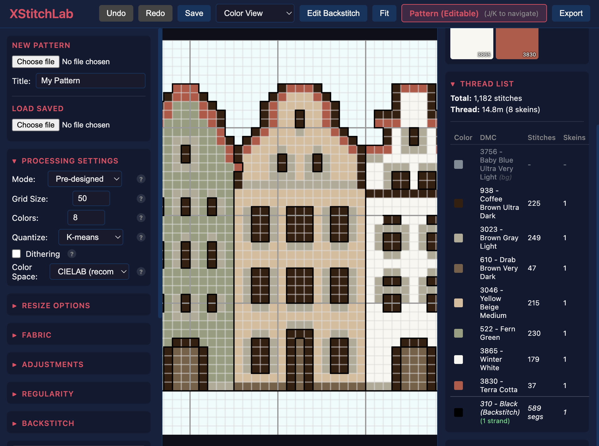

# XStitchLab

A cross-stitch pattern design tool with an end-to-end pipeline: from image to stitchable pattern with DMC thread mapping, previews, and PDF export.



## What it does

**Image &rarr; Pixelation &rarr; Color mapping &rarr; Pattern &rarr; Thread estimation**

Take any image — or generate one with AI — and turn it into a cross-stitch pattern with real DMC thread colours, stitch counts, and printable instructions.

### Features

- **Image processing**: Resize to stitch grid, colour quantization (k-means), dithering control
- **DMC colour mapping**: Perceptual colour matching using CIELAB &Delta;E against the full DMC palette (~500 colours)
- **Interactive editor**: Browser-based pattern editor with real-time preview, backstitch editing, colour adjustments
- **Pattern output**: Symbol grids, colour legends, stitch counts per colour
- **Thread estimation**: Calculate thread requirements by colour, with fabric count and wastage factors
- **Multiple exports**: PNG previews (colour block, symbol grid, stitch render), printable PDF patterns, JSON data
- **AI generation**: Generate source images from text prompts via DALL-E 3

## Architecture

The project has three components:

- **`xstitchlab/`** — Core Python package: image processing, pixelation, DMC mapping, thread calculation, pattern export
- **`backend/`** — Flask API server exposing the pipeline as REST endpoints
- **`frontend/`** — React/Vite browser-based pattern editor with interactive controls

```
xstitchlab/
├── core/
│   ├── image_input.py        # Load/validate images
│   ├── ai_generator.py       # OpenAI DALL-E integration
│   ├── pixelator.py          # Resize + quantize
│   ├── color_mapper.py       # RGB → DMC mapping (CIELAB)
│   ├── pattern.py            # Pattern data structure
│   ├── thread_calc.py        # Thread estimation
│   └── visualizer.py         # Render previews
├── export/
│   ├── pdf_exporter.py       # Printable PDF patterns
│   └── png_exporter.py       # Image export
└── data/
    └── dmc_colors.json       # DMC thread database (~500 colours)
```

## Getting started

### Prerequisites

- Python 3.11+
- [uv](https://github.com/astral-sh/uv) (recommended) or pip
- Node.js 18+ (for the frontend)

### Installation

```bash
git clone https://github.com/tomekhotdog/XStitchLab.git
cd XStitchLab

# Backend
uv sync

# Frontend
cd frontend && npm install
```

### Running

```bash
# Start both backend and frontend
./run-dev.sh

# Or individually
./run-backend.sh
./run-frontend.sh
```

### CLI usage

```bash
# Convert an image to a cross-stitch pattern
uv run xstitch convert image.png --size 40 --colors 8

# Generate pattern with AI (requires OPENAI_API_KEY)
uv run xstitch generate "medieval building facade" --style architecture

# Estimate thread requirements
uv run xstitch estimate pattern.json --fabric 14
```

## Tests

```bash
uv run pytest tests/
```

## Background

XStitchLab started as a tool to generate cross-stitch kits featuring historic Hanseatic architecture — medieval trading cities like Riga, L&uuml;beck, and Bergen. The pipeline is general-purpose and works with any image or theme.

Visit [xstitchlabs.com](https://xstitchlabs.com) to learn more.

## Licence

MIT
